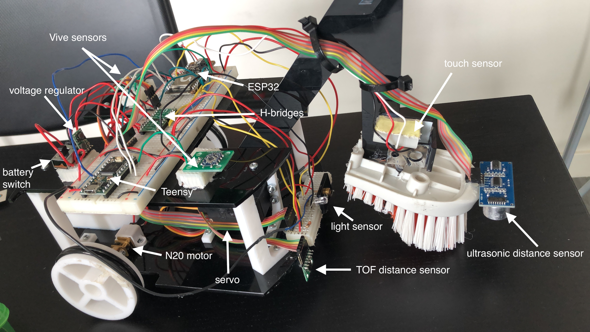

# Design Competition 2019, Team TOTEM
### Team members: Christopher Tsai, Haolin Nie, Juan Solera, Alejandro Alfaro
Course-wide project for DSGN 360: Design Competition, Northwestern University, Spring 2019.

## Introduction & Rules
Design Competition (DC) is an annual competition hosted by Northwestern's McCormick School of Engineering during spring quarter. It consists of student teams building autonomous or semi-autonomous robots that complete a task. The official rules for the 2019 competition were:

*"The arena is divided into two 6' x 6' squares, with a barrier between them to **block** the view of the driver. Teams place their robot in the opposing square, and their four tokens in their own square.*

*The team that first removes all of their opponents tokens wins. If after 3 minutes neither team has removed all of the tokens, points are awarded for the tokens that have been removed: 4 points for the smallest down to 1 for the largest. The team with the most points wins. In the event of a tie, the round is run again. In the event of three ties, the winner is decided by coin toss.*

*A removed token has been pushed off or ejected from the 6' square.*

*Your robot must fit in a 10" cube at the beginning of the round. The robot may be remote controlled by a driver using Bluetooth-classic and a computer program. Data may be streamed in either direction. The robot can be fully autonomous, semi autonomous, or fully remote controlled."*

Below is an image of the arena. Barriers must be placed in the purple squares and robots can be placed at any location. The arena also contains two HTC Vive Base Stations for robots to use to determine their locations in the arena.

The tokens were wooden cubes covered with reflective tape. They contained a cylindrical hole through their vertical axis.

## Overall Strategy
Take advantage of the holes in every token by using a cleaning brush to drag the block around. The brush would be attached to an arm that rotated up and down using a servo. The arm would also provide enough downward force to cause the block to move by friction between it and the brush hairs. Cut the hairs at an angle (mimicking a wedge) to increase the frictional force between them and the blocks.

Sense the position of the robot in respect to the map (using a GPS-like feature) as well as the blocks' positions.

## Design

### Mechanical Design
The body of the robot was made out of laser-cut acrylic. It was purely structural and designed to support breadboards and wiring, and was essentially two “shelves”. The body also consisted of an arm that held the weapon at the end. 

The "weapon" was a brush whose spokes would grab the token’s hole and drag the token out of the field. The brush was connected to a servo that would move the weapon down if there was a token to grab it, and up to release it or so that the brush itself would not drag on the floor. 

The robot had two wheels which spun in response to servos, and one wheel as a third point of contact to establish stability. The wheels each had a servo so that there would be differential drive, so moving forward and backward the wheels were spinning in the same direction, but to move left and right they would spin opposite each other. These wheels had an axis connecting them together and were part of the body. 

The main voltage source of the robot was a 12V battery, so a 3D-printed battery holder was used to secure it.

### Locomotion
Robot moved using a differential drive mechanism, commanded by the WASD keys on a computer and communicating with the computer using the Bluetooth module of the microcontroller. It was not autonomous, and instead was driven by team members following the live-updated location and object detection information provided by the robot. Each direction (forward, backward, left, right) had two options: fast or slow. Fast was mostly for actual movement within the field, and slow was for scanning the field for tokens or obstacles, or when the robot was nearing the edge to drop an obstacle.

### Electronics

#### Microcontroller
An Adafruit ESP32 Feather was used to communicate with the sensors and motors. It transmitted sensor data using Bluetooth, and the computer received it using a USB Bluetooth adapter. The Arduino IDE was used for programming (see `arduino_code` folder for all code). 

#### Actuators
Three motors were used — two N20 DC motors for the wheels and one servomotor for the weapon. They were controlled by the user by pressing different keys on the keyboard. They were connected to the ESP32 through MAX14870 H-bridges. The weapon moved up and down approximately 40 degrees.

The motors on the wheels were fed PWM signals from the ESP32, and there were two speeds — fast and slow, where the fast speed had a duty cycle of approximately 70% and the slow speed had a duty cycle of approximately 30%. There was also a pin for direction that would make the wheel move forward or backward.

#### Sensors
Two Triad TS3633 sensors were used to detect where the robot was on the map. These sensors were built to interface with HTC Vive Base Stations for 3D position tracking. Two sensors were used because calculating the robot’s direction required calculating the angle that the two sensors made with each other. The sensors were paired with a Teensy chip, which transmitted the data to the ESP32.

A Pololu VL53L0X time-of-flight distance sensor was used to detect obstacles in front of a robot. It could sense up to 400 cm away.

To be able to locate the tokens, a laser and a phototransistor were used. A high voltage on the transistor would indicate that the laser light had reflected off the reflective material on the tokens. This sensor was next to the distance sensor, which meant that a token was detected if both sensors detected an object.

To know if a block was caught, a touch sensor was attached to the brush. When a block was caught, it would push against a small cylinder which would in turn push on the touch sensor:

An additional HC-SR04 ultrasonic distance sensor was connected to the block looking down to determine the distance between the robot and the ground (so that the robot wouldn’t fall off the platform out of bounds) but this drew too much current and made everything lag when connected to the Arduino.

#### Power
A 12V battery was used to power the motors and a Pololu S10V4F5 5V step-up/step-down voltage regulator was used to bring down the voltage to 5V for the rest of the electronics.

### Python GUI & Coordinate Transformations
To command the robot and detect its position and sensor values, a Python GUI was implemented. As mentioned before, robot drivers were not allowed to see the arena during the competition so this GUI was a command center of sorts. 

As seen above, the GUI displayed all sensor information on the right and contained a map of the arena on the left. The position of the robot was indicated by one of the faces, which the user could change by simply clicking on them. The demo below shows the robot being rotated and its position on the GUI moving accordingly, as well as the sensor values being updated in real time:

Calibration

## Folder Descriptions
